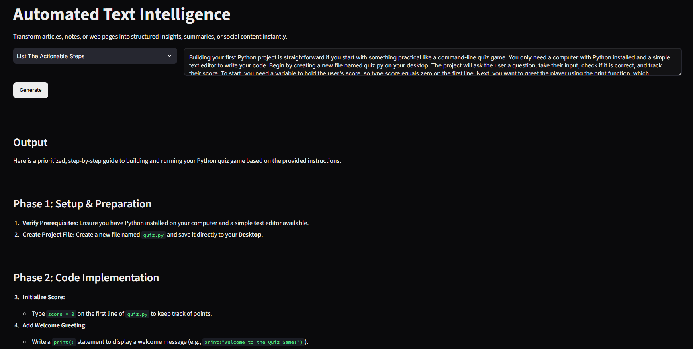

# Automated Text Intelligence

A streamlined web application for rapid text parsing, summarization, and insight extraction utilizing LLLMs (Large Language Models).
## Preview

> 

**🔗 [View Live Application](https://jatinp-textintel.streamlit.app/)**

## Overview
This application provides a smooth interface for processing raw, unstructured data. It allows users to input raw text or scrape direct web URLs, routing the data through the Gemini API to generate structured outputs such as concise summaries, actionable task lists, or tailored social media messages.

## Core Features

-   **Automated URL Parsing:** Integrates `BeautifulSoup4` to automatically extract core textual content from web pages, filtering out navigation and footer bloat.
-   **State Management:** Utilizes Streamlit's session state to persist API outputs across UI interactions, preventing redundant processing.
-   **Dynamic Processing Modes:** Selectable operational modes to tailor the LLM output strictly to the user's immediate requirement (Summarize, Action Items, Social Messages).
-   **Secure Credential Handling:** API keys are managed securely via deployment environment variables, ensuring zero credential exposure in the public codebase.
## Tech Stack

- **Python** (Backend logic)
- **Streamlit** (Frontend and UI)
- **Requests, BeautifulSoup4** (Web scraping)
- **Google GenAI SDK (Gemini Flash)** (LLM integration)

## Deployment
This application is deployed via Streamlit Community Cloud.

**Live Application:** https://jatinp-textintel.streamlit.app/